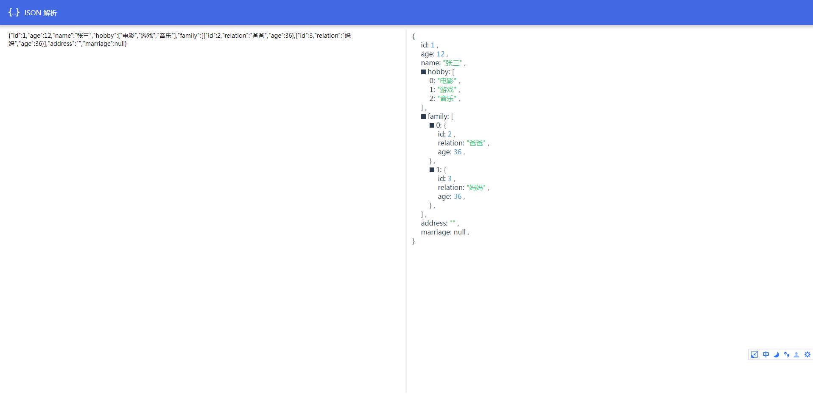

# JSON 解析

一款高颜值的 JSON 数据解析查看工具，无需网络加载，本地即可运行，支持`Object`和`Array`两种数据格式。

Git 地址：https://github.com/Jin0811/JSON

## 1 使用方法

下载 Git 仓库当中的代码，双击打开目录当中的`index.html`即可

## 2 示例

```json
{
  "id": 1,
  "age": 12,
  "name": "张三",
  "hobby": ["电影", "游戏", "音乐"],
  "family": [
    { "id": 2, "relation": "爸爸", "age": 36 },
    { "id": 3, "relation": "妈妈", "age": 36 }
  ],
  "address": "",
  "marriage": null
}
```


